!!! tip "Donothon Mode"
    If you want to adjust the subathon to be a donothon, that is done by configuring your goals list to be of type "Money" instead of "Points". Even if you have no goals.

!!! info "Generic Alert / Timerless Mode"
    To use this as a generic alert system for overlays, or a timerless event with goal tracking, "unlock" the subathon timer and ensure everything you want to have tracked or overlays for has seconds or points configuration above 0. In these cases, set the timer to a very high number, such as `300d`, to ensure it won't hit zero and auto lock.

---

## Subathon Controls

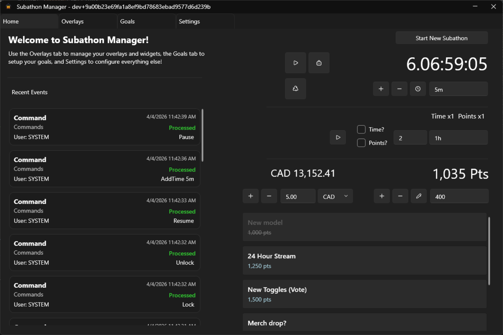

### Subathon & Time Management

In this section, you can create a new subathon with an initial time set by clicking the `start new subathon` button. You can also specify if it is a **reverse subathon** in the popup, which if true, will make the timer tick up, but all events will reduce time instead.

In addition to viewing what the current timer value is, you can also toggle **pausing** and **locking** the subathon.

There is a button to quickly force refresh all browser overlays.

Finally, there is a section for quick adding, removing, or setting of time. Format for time is the same as commands, such as `#d#h#m#s`.

### Multiplier Control

Here you can initiate a multiplier for either time, points, or both.

The duration is optional - if not set, multiplier only ends on app restart or force end. If set, multiplier values will reset to `1x` when it counts down to 0.

It will preview the current multiplier values as well as a current duration if enabled and active. You can also stop a multiplier here at any time.

!!! note
    Multiplier values can be any positive number, e.g. `2`x, `2.5`x. The only limitation is both time and points share the same multiplier.

### Points Management & Upcoming Goals

In this section, you can preview your current points in the subathon, as well as quick add, subtract, or set the points.

Under here, you can preview your upcoming goals list with their points value, as well as see your most recently completed goal.

---

## Recent Event List

This list contains a subset of recent events processed by your active subathon!

For each event, you will see the event type, source, time, user who triggered it, and its value(s). Additionally, you will see whether or not it was successfully processed.

- **Delete** an event from this list to *undo* the time/points associated with it, if applicable.
- If an event is not processed, you are able to try **reprocessing** it.

---

## Overlays

To use an overlay in OBS, please create a browser source of the correct height and width, then paste in the link for your overlay that you can copy from here.

### Overlays Page

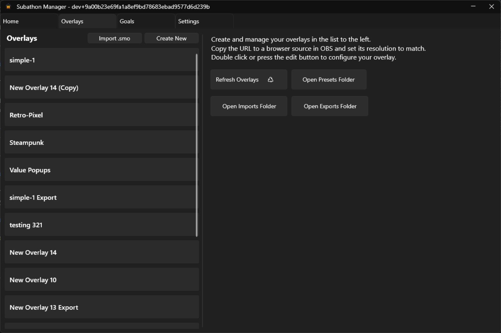

On this page, you will see on the left, a list of all your current overlays.

From here, you can create a new overlay, or select one from the list where you can then copy the url, edit it (via button or double click), duplicate it, export it, or permanently delete it.

On the right, you will see a button which will let you quickly refresh all overlays that are open.

!!! info "Overlay Export / Import"
    You can export any overlay and it will attempt to get all associated files, and save all configuration, then create a `.smo` file. This file can be shared and imported again here as a brand new, premade overlay with all config and files needed!

### Editor

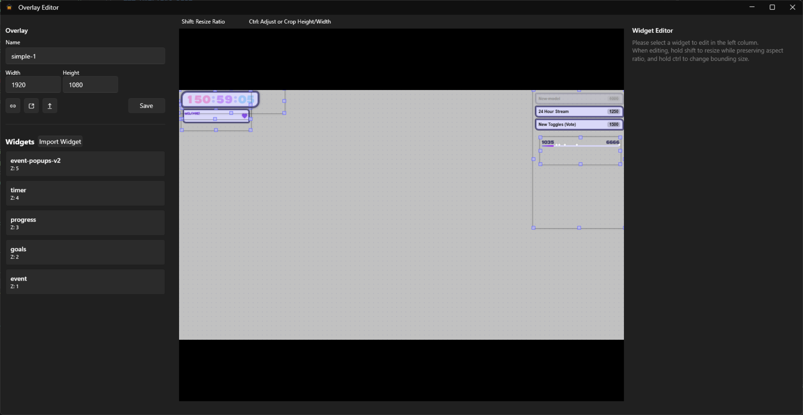

=== "Overlay Settings"

    You can rename an overlay here, as well as set its Width and Height.

    It is important to match this width and height when you create your OBS browser source for the best results.

    You can copy the link, open it in a browser, or save your settings here.

    Saving the overlay will cause it to refresh in all places.

    

    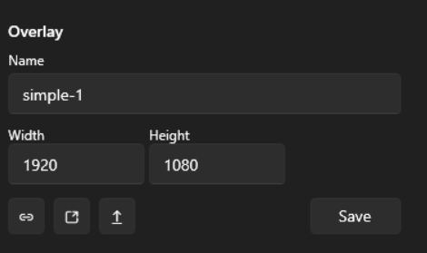
    

=== "Widget Control"

    A list of widgets will be shown here that are active in the overlay.

    You can also import new widgets as html files from your system with the **Import Widget** button.

    Their order (also indicated by the Z value) dictates overlapping rules. Widgets higher up / with a bigger number will appear above others.

    Options are available to **toggle visibility**, which keeps the widget in the overlay but not visible when in OBS.
    You can adjust the overlap position with the arrows, open the widget in the widget editor (or via double click), duplicate the widget, or delete it from the overlay.

    When you double click or click the edit button on a widget in this list, it will populate it in the *Widget Editor* for customization.

    

    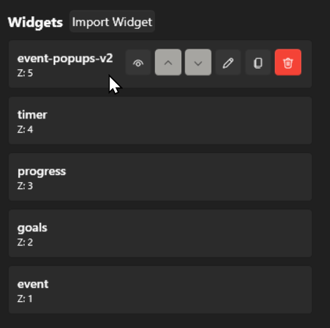
    

=== "Built-In Editor"

    This editor preview allows you to view what the widgets in the overlay will currently look like.

    You can drag and move around the widgets, as well as click them to select them to populate in the *widget editor* on the right.

    You can hover over a widget to view its name and Z value, and widgets with visibility toggled off will be faded.

    You can resize widgets in the editor, and by holding shift and dragging an orange corner, you can preserve aspect ratio while resizing.

    
    

    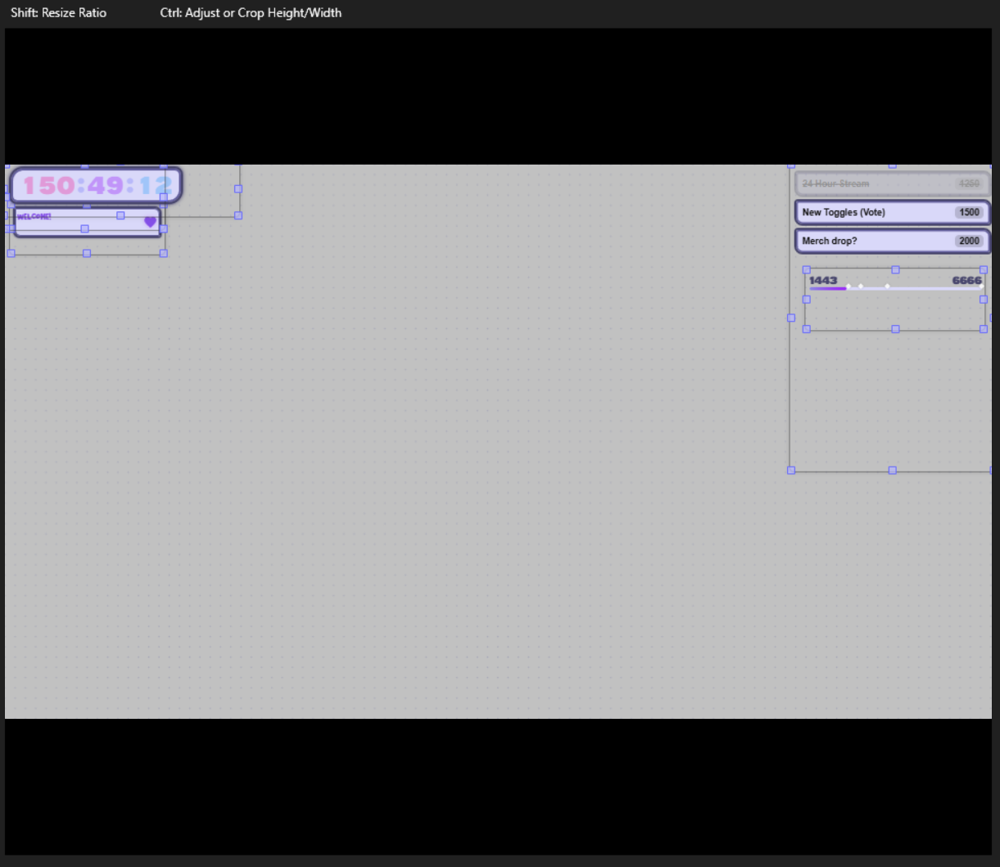
    

=== "Widget Editor/Settings"

    When a widget is selected either via the list or the preview UI, you can do various actions.

    You can rename the widget, set its width and height, and change its X and Y position (will also update when you drag them around).

    

    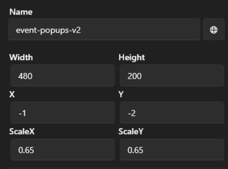
    

    A list of detected CSS variables will also be displayed, which you can customize to *override* defaults found as CSS Vars in your linked CSS variables from within the widget's local referenced css files.

    

    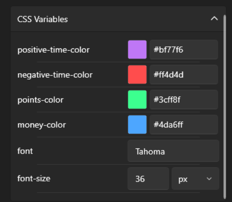
    

    

    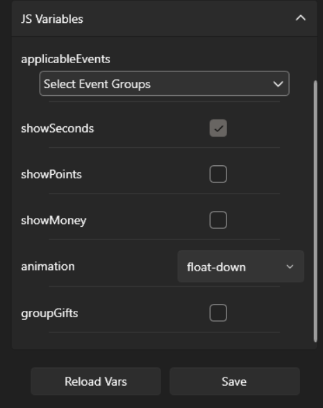
    

    To load and preview your customizations, you will need to click **Save**. To reload CSS variable detection from your raw files, click the **Reload CSS Vars** button.

    Saving any widget will cause the overlay to refresh in all places.

---

## Goals

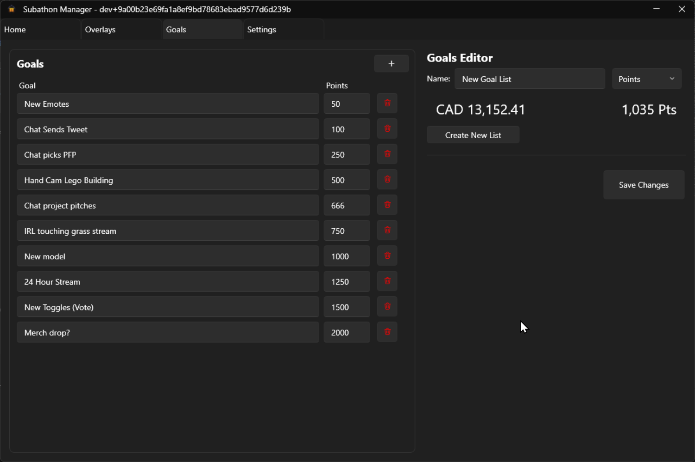

### Goals List

Goals are tracked separately from your subathon, so that once you set them up, they will persist here unless edited or a new list is made.

You can add new goals with the **+** button, where for each goal you can set the Text and the number of Points required to achieve. Each goal can also be deleted, and the list will always be sorted from lowest to highest points.

To save changes, click the Save button in the Editor pane.

### Goals Editor

In the goals editor, you can set a new name for your current goals list. This name is only for logging and self-organization purposes, as only one set of goals can be active at any given time.

You can preview your live current number of points on this page.

Clicking the **Create New List** button will create a whole new empty goals list.

To save changes to your list, click **Save Changes**.

---

## Settings

See [Configuration](Configuration.md)

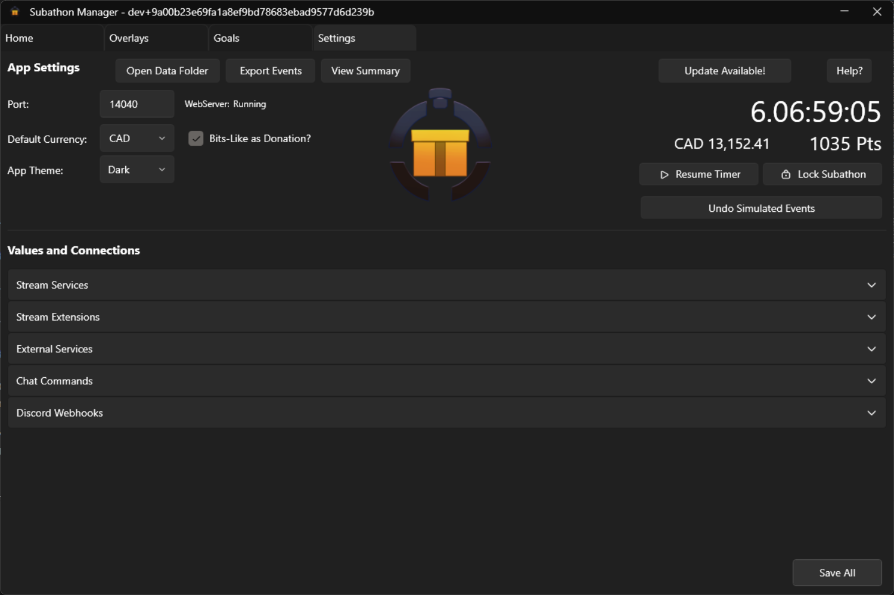

---

## Chat Commands

See [Configuration](config/Commands.md) for the command names. You can change the defaults.

=== "Points"

    | Command | Description | Example |
    |---|---|---|
    | `!addpts` | Add a number of points | `!addpts 10` |
    | `!subtractpts` | Remove a number of points | `!subtractpts 10` |
    | `!setpts` | Set the points to a specific number | `!setpts 140` |

=== "Timer"

    | Command | Description |
    |---|---|
    | `!pause` | Pause the timer from counting down |
    | `!resume` | Resume counting down the timer |

    Controls: 

    - Time format: `##d##h##m##s` - e.g. 5 minutes can be `300s` or `5m`

    | Command | Description | Example |
    |---|---|---|
    | `!addtime` | Add time | `!addtime 1h30m` |
    | `!subtracttime` | Remove time | `!subtracttime 5m` |
    | `!settime` | Set time | `!settime 8h35m5s` |

=== "Multiplier"

    The multiplier can apply to either time, points, or both. It can also be supplied an optional duration, after which, it will reset to `1x 1x`. Multipliers are not preserved between app restarts.

    **Format:** `#xt` for Time only · `#xp` for Points only · `#xpt` or `#xtp` for both · `##d##h##m##s` for optional duration

    | Command | Description | Example |
    |---|---|---|
    | `!setmultiplier` | Set multiplier. Overwrites any current multiplier. | `!setmultiplier 2xtp 2h` · `!setmultiplier 2xt 30m` · `!setmultiplier 2.5xpt` |
    | `!stopmultiplier` | Stop the multiplier entirely, resetting to `1x` for both time and points | - |

=== "Money"

    | Command | Description | Example |
    |---|---|---|
    | `!addmoney` | Add money, does not affect time. Requires a currency. | `!addmoney 10.15 CAD` |
    | `!subtractmoney` | Remove money. Requires a currency. | `!subtractmoney 10 USD` |

=== "Other"

    | Command | Description |
    |---|---|
    | `!lock` | Lock the subathon, preventing new events from contributing |
    | `!unlock` | Unlock the subathon so all events can be added |
    | `!refresh` | Refresh *all* active browser overlays |

---

## External Commands

See [Development - External Commands](Development.md#external-commands)