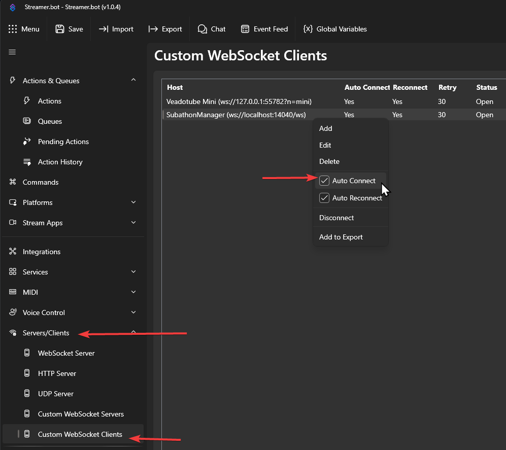
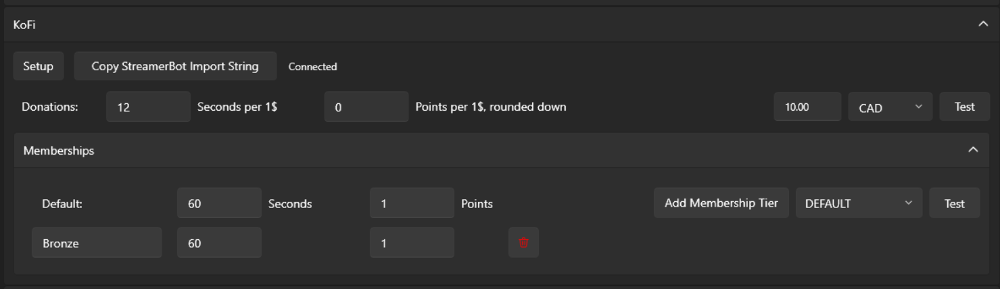

KoFi setup requires Streamer.Bot. Clicking the **Setup** button will open this guide for connecting KoFi to Streamer.Bot and configuring the required actions.

| Value | Description |
|---|---|
| **Donations** | Seconds per 1$, Points per 1$ (rounded down). 1$ of Default Currency after conversion. |
| **Memberships** | Seconds and points per membership. Add tiers with the **Add Membership Tier** button - the name must match the tier name from KoFi exactly. |

## StreamerBot Setup

To integrate KoFi, StreamerBot is currently required.

- Install & Setup [Streamer.Bot](https://streamer.bot/)
- [Set Up KoFi with Streamer.Bot](https://docs.streamer.bot/guide/integrations/ko-fi)
    - This requires the Streamer.bot Website Integration setup, with a logged in account.
- Copy the string/text from in SubathonManager
- In Streamer.Bot's desktop app, click "Import" and paste in the string.
- In Streamer.Bot, go to Server/Clients -> Custom WebSocket Clients -> Find `SubathonManager`. Right click it, and enable "Auto Connect" if it is not already enabled.

You can test the connection from KoFi -> StreamerBot -> SubathonManager by firing events from [KoFi here](https://ko-fi.com/manage/webhooks?src=sidemenu).

You can verify Streamer.Bot is connected to SubathonManager by checking its configuration in the settings and it will say Connected or Disconnected next to the import string copy button.

Supports:

- Donation/Tips, Memberships subscriptions, Membership resubscriptions
- Monthly recurring tips are treated as Donation/Tips
  
## Configuration

You can configure KoFi natively in the UI's Settings tab.

By default, all memberships/subs will be treated using the values for DEFAULT. If you want to support your custom membership tiers, please add new tiers with the button and match the tier name with the first text field.

To import the action string, you can copy it from within the application, find it in the latest release assets, or get the [raw file here](https://raw.githubusercontent.com/WolfwithSword/SubathonManager/refs/heads/main/external/streamerbot/SubathonManager_KoFi.sb).