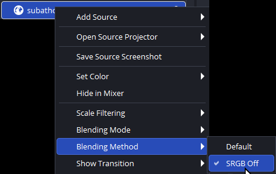

For various issues with widgets, please try these troubleshooting steps.

# Widgets are faded / grey / desaturated in OBS

If you notice your widgets with some transparency look weird, grey, or dim in OBS when on lighter or white backgrounds, then you need this fix.

In OBS on your `Browser Source`, Right Click -> Blending Method -> Select `SRGB Off`

This will fix semi-transparent, faded, glowing effects in OBS when on lighter backgrounds. This is caused by OBS's internal browser source doing alpha blending weirdly for anything with blur or opacity filters.